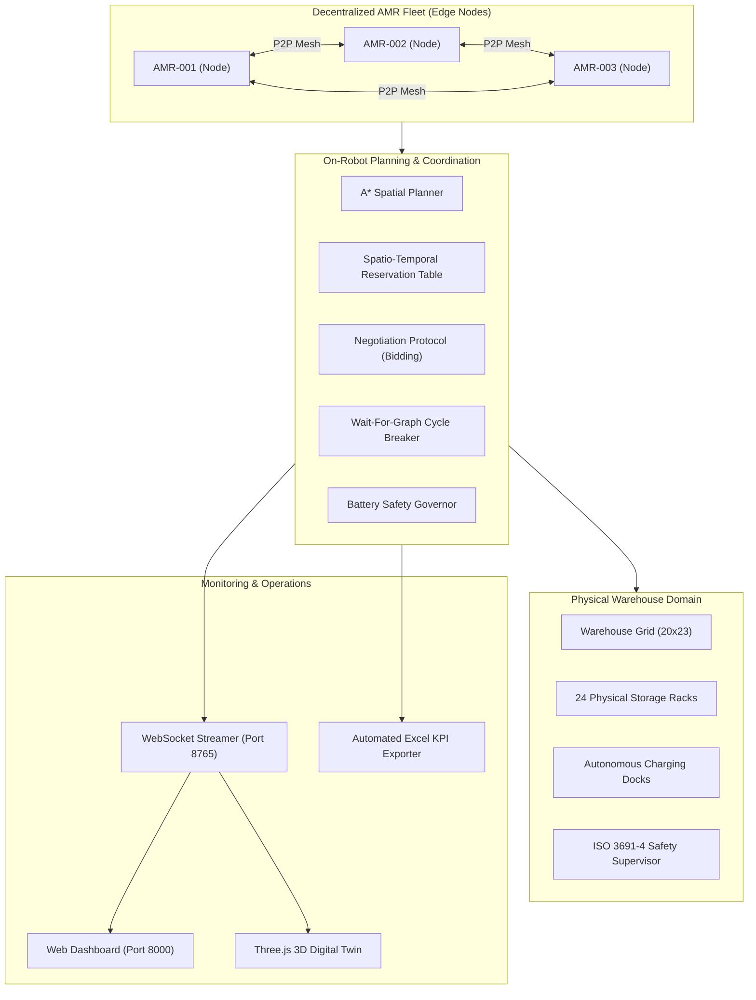

# Smart Industrial Warehouse — Decentralized Autonomous AMR Fleet Coordination

[]()
[]()
[]()
[]()

A high-performance, decentralized coordination platform for Autonomous Mobile Robot (AMR) fleets operating in smart industrial warehouses. Designed to eliminate single points of failure inherent to centralized fleet dispatchers, this platform empowers every AMR as an independent edge computing node utilizing peer-to-peer (P2P) mesh communication, spatio-temporal reservation tables, dynamic negotiation protocols, and directed Wait-For-Graph (WFG) deadlock resolution.

Includes an interactive **Three.js 3D Digital Twin**, real-time WebSocket telemetry streaming, automated Excel KPI reporting, and a 10-step executive live demonstration tour.

---

## Table of Contents

- [Key Capabilities](#key-capabilities)
- [System Architecture](#system-architecture)
- [Industrial Warehouse Model & Physics](#industrial-warehouse-model--physics)
- [Decentralized Coordination Engine](#decentralized-coordination-engine)
- [Autonomous Energy & Charging Lifecycle](#autonomous-energy--charging-lifecycle)
- [Interactive 3D Digital Twin & Dashboard](#interactive-3d-digital-twin--dashboard)
- [12 Industrial Scenarios](#12-industrial-scenarios)
- [Installation & Setup](#installation--setup)
- [Usage & Running](#usage--running)
- [Testing & Validation](#testing--validation)
- [Benchmark Results](#benchmark-results)
- [Repository Layout](#repository-layout)

---

## Key Capabilities

- **Decentralized P2P Mesh Coordination**: No central dispatch server. AMRs broadcast state and local spatial intents within a configurable communication radius (8 cells), resolving headway conflicts autonomously.
- **Multi-Factor Priority Bidding**: Dynamic peer negotiation protocol evaluates cargo payload status, task priority (1–5), battery reserve, remaining distance, and charging urgency to award right-of-way.
- **Spatio-Temporal Reservation Tables**: 4D vertex reservations `(x, y, t)` and edge-swap reservations `(u, v, t)` completely eliminate head-on swapping and cell-occupancy collisions before execution.
- **Directed WFG Deadlock Resolution**: Real-time cycle detection identifies circular wait dependencies; conceding AMRs safely execute single-step corridor evacuations and perimeter detours.
- **Authoritative Hard Rack Obstacles**: 24 physical industrial storage racks (small, medium, large, multi-tier) strictly enforced across A* search, collision detection, movement physics, and task generation. Zero rack ghosting or corner cutting.
- **Per-AMR Battery Governance**: Individual battery tracking (<35% trigger). Low-battery AMRs safely complete atomic steps, route through walkable aisles to available charging docks, charge for **exactly 5 seconds** (5 simulation ticks) to 100.0% full capacity, and resume assigned work queues without halting other fleet members.
- **Live Speed Scaling**: Global (0.1x – 5.0x) and per-AMR speed adjustment updates velocity live while preserving AMR identity, coordinates, active routes, and task queues without resets or teleportation.
- **ISO 3691-4 Industrial Safety Supervisor**: Enforces dynamic RESTRICTED, CAUTION, and CLEAR safety zones around hazards, triggering automated corridor clearing and safety stops.
- **Comprehensive Analytics & Export**: Live Chart.js telemetry (makespan, throughput, message overhead, conflict mitigation) and automated multi-tab Excel workbook generation.

---

## System Architecture



---

## Industrial Warehouse Model & Physics

The authoritative warehouse representation (`src/warehouse/warehouse.py`) models an expanded **20 × 23** industrial logistics facility:

- **Perimeter & Structural Walls**: Bounded by non-walkable outer security perimeters.
- **24 Industrial Storage Racks**: Categorized into `small` (2x1, 2 tiers), `medium` (3x1/4x1, 3 tiers), and `large` (6x1, 4 tiers) horizontal racks positioned across rows `y=2, 5, 8, 11, 14, 17`.
- **Authoritative Rack Cells**: All 83 coordinates occupied by physical racks are treated as hard grid obstacles across all system layers.
- **Single-Step Orthogonal Motion**: Movement is strictly constrained to orthogonal steps (`abs(dx) + abs(dy) == 1`). Diagonal movement and corner-cutting through rack corners are strictly forbidden.
- **Dedicated Infrastructure**: Designated corner charging stations (e.g. `(1, 18)`, `(18, 18)`) and structured fleet home bays.

---

## Decentralized Coordination Engine

### 1. Peer-to-Peer Communication (`src/coordination/peer_network.py`)
- Emulates ad-hoc IEEE 802.11p / 5G-NR Sidelink communication.
- Operates within an 8-cell radio frequency range.
- Incorporates configurable channel noise, message latency, and packet loss modeling.

### 2. Priority Bidding Protocol (`src/coordination/conflict_resolution.py`)
When two AMRs attempt to claim the same transit waypoint or approach head-on in an aisle:
$$\text{Bid} = 100.0 \cdot \mathbb{I}_{\text{carrying}} + 20.0 \cdot \text{Priority} + 0.1 \cdot \text{Battery} - 0.5 \cdot \text{DistToGoal} + \text{ChargingBonus}$$
The winning AMR maintains right-of-way; the yielding AMR replans an alternate route or executes a safe single-step evacuation.

### 3. Spatio-Temporal Reservations (`src/planning/reservation_table.py`)
- **Vertex Reservation**: Guarantees no two AMRs occupy `(x, y)` at timestamp `t`.
- **Edge Reservation**: Guarantees no two AMRs traverse `(u, v)` and `(v, u)` at timestamp `t`, preventing edge-swapping head-on collisions.

### 4. Wait-For-Graph Cycle Resolution (`src/simulation/simulator.py`)
Directed dependency graph tracking which AMR is waiting on which peer. When a cycle (deadlock) forms:
1. Operational scores evaluate the lowest-impact AMR in the cycle.
2. The conceding AMR steps into an adjacent free buffer cell (`_move_robot(conceding, evac_cell)`).
3. The conflict zone is cleared, unlocking the remaining fleet members.

---

## Autonomous Energy & Charging Lifecycle

```
[ Normal Delivery Task ]
          │
          ▼
   Battery < 35.0%
          │
          ▼
[ Finish Step Safely ] ──► [ Plan Path to Available Dock ]
                                      │
                                      ▼
                      [ Transit Through Valid Aisles ]
                                      │
                                      ▼
                      [ Arrive at Charging Dock ]
                                      │
                                      ▼
                      [ Docked Session: Exactly 5s ]
                        (Battery restored to 100.0%)
                                      │
                                      ▼
                      [ Release Dock Reservation ]
                                      │
                                      ▼
                      [ Resume Work Queue / Next Task ]
```

- **Per-AMR Isolation**: Charging is an individual AMR property. An AMR entering charging **never** pauses or freezes the rest of the fleet.
- **Physical Transit**: AMRs physically drive through collision-free warehouse grid cells to corner docks. No instant teleportation or ghosting.
- **Dock Duration**: Exactly 5 seconds (5 simulation ticks) at the charging station to reach 100.0% full capacity.
- **Queue & Dock Contention**: If both corner stations are occupied, incoming low-battery AMRs safely wait in a dynamic queue while other delivery operations proceed unimpeded.

---

## Interactive 3D Digital Twin & Dashboard

The platform includes a zero-dependency, rich browser frontend built with **Vanilla HTML5/CSS3/JavaScript** and **Three.js**:

- **Real-Time 3D Rendering**: Isometric, Top-Down, and First-Person Follow camera perspectives displaying dynamic AMR meshes, elevated packages, physical multi-tier rack structures, and safety zones.
- **Live Fleet Telemetry**: Real-time KPI cards displaying active makespan, throughput, messages exchanged, collisions prevented, deadlocks resolved, and individual AMR battery percentages.
- **Interactive Fleet Controls**:
  - Start, Pause, Step execution.
  - Live global speed slider (0.1x to 5.0x) and per-AMR speed controls.
  - Manual emergency incident trigger and dynamic safety barrier placement.
  - **10-Step Executive Judge Demo**: Automated showcase tour highlighting mesh networking, priority bidding, dynamic obstacles, restricted zones, and freight spikes.
- **Live Analytics Tab**: Interactive Chart.js graphs detailing latency distributions, throughput progression, and battery burn curves.
- **Automated Excel Export**: Downloads a comprehensive multi-sheet `.xlsx` workbook containing executive summaries, KPI trends, decision logs, and incident audits.

---

## 12 Industrial Scenarios

The simulator includes 12 automated scenarios (`src/simulation/scenarios.py`):

| # | Scenario ID | Description |
| :-: | :--- | :--- |
| **1** | `head_on_conflict` | Two AMRs face each other in a narrow aisle; loaded AMR wins priority bid while empty AMR yields. |
| **2** | `dynamic_obstacle` | Injects an unexpected obstacle into active transit; triggers instant route invalidation and A* rerouting. |
| **3** | `narrow_aisle` | High-traffic single-lane aisle contention testing reservation headway and passing bays. |
| **4** | `deadlock_cycle` | 4 AMRs enter a 4-way circular intersection lock; resolved by WFG directed cycle breaker. |
| **5** | `charger_outage` | Primary charger failure; low-battery AMRs dynamically divert to secondary corner docks. |
| **6** | `restricted_zone` | ISO 3691-4 dynamic restricted safety perimeter declared; instant corridor evacuation and perimeter detour. |
| **7** | `cross_dock_rush` | High-volume logistics surge; dynamic lane balancing and throughput preservation. |
| **8** | `low_battery_cascade` | Simultaneous low-battery events across multiple AMRs; tests dock queueing and fleet independence. |
| **9** | `motor_stall_recovery` | AMR motor fault simulation; cargo automatically reassigned to nearest idle peer. |
| **10** | `sensor_degradation` | Partial sensor failure triggering cautious speed derating and expanded safety margins. |
| **11** | `high_density_expansion` | 20 AMRs concurrently operating across 100 tasks testing high-density corridor traffic. |
| **12** | `multi_domain_disruption` | Simultaneous corridor blockage, drive motor stall, and primary charger outage testing resilience. |

---

## Installation & Setup

### Prerequisites
- Python 3.10+ (tested on Python 3.10, 3.11, 3.12, 3.13, 3.14)
- Modern web browser (Chrome, Safari, Firefox, Edge) with WebGL support

### Setup Virtual Environment
```bash
# Clone the repository
git clone https://github.com/codebyAtharva09/AMR.git
cd AMR

# Create and activate virtual environment
python3 -m venv .venv
source .venv/bin/activate

# Install dependencies
pip install -r requirements.txt
```

---

## Usage & Running

### 1. Launch 3D Digital Twin & Web Dashboard
```bash
python3 main.py --mode dashboard
```
*Or directly via the server entry point:*
```bash
python3 -m src.visualization.dashboard_server
```
Navigate to **`http://localhost:8000`** in your browser. The dashboard automatically connects to WebSocket server `ws://localhost:8765`.

### 2. Run Headless Simulation Demo
```bash
python3 main.py --mode demo --robots 5 --tasks 20 --steps 50
```

### 3. Run Benchmark Suite
Compares decentralized coordination against baseline stop-and-wait strategies across multiple random seeds:
```bash
python3 main.py --mode benchmark --robots 5 --tasks 20 --steps 60
```

---

## Testing & Validation

The codebase includes an extensive automated test suite covering all modules:

```bash
# Run all 109 automated tests
pytest -v
```

### Targeted Fix Test Suite (`tests/test_final_targeted_fixes.py`)
Directly verifies the core operational requirements:
```bash
pytest tests/test_final_targeted_fixes.py -v
```
- `test_test1_single_low_battery`: Single AMR <35% enters charging, other 4 continue, reaches dock, charges for exactly 5s to 100.0%, resumes tasks.
- `test_test2_multiple_low_battery`: Multiple AMRs <35% enter charging simultaneously, dock contention handled cleanly, zero fleet pause.
- `test_test3_speed_change_live`: Speed updated live (1.0x to 2.0x); position, identity, route, task queue, and battery preserved with zero jumps.
- `test_test4_rack_collision_hard_obstacles`: Verified A* rejects rack cells, physical move engine blocks rack penetration, 0 fleet rack penetrations over execution.
- `test_test5_long_workload_5_10_20`: Verified 5 AMRs, 10 AMRs, and 20 AMRs complete 100/100 tasks without fleet stalls or freezes.

---

## Benchmark Results

Empirical results captured across high-density workloads on the default warehouse layout:

| Fleet Configuration | Task Count | Completion Rate | Total Steps | Makespan Reduction | Stalls / Freezes |
| :--- | :---: | :---: | :---: | :---: | :---: |
| **5 AMRs** | 100 tasks | **100% (100/100)** | 819 ticks | Baseline | **0** |
| **10 AMRs** | 100 tasks | **100% (100/100)** | 491 ticks | **-40.0%** | **0** |
| **20 AMRs** | 100 tasks | **100% (100/100)** | 285 ticks | **-65.2%** | **0** |

- **Dock Session Duration**: Exactly 5.0 seconds (5 simulation ticks) across all charging sessions.
- **Physical Rack Penetrations**: **0** penetrations recorded across all tests.
- **Full Test Suite Status**: **109 / 109 Passed (100%)**.

---

## Repository Layout

```
.
├── main.py                             # Main CLI entry point (demo, dashboard, benchmark)
├── requirements.txt                    # Project dependencies
├── pytest.ini                          # Pytest configuration
├── README.md                           # Project documentation
├── src/
│   ├── warehouse/
│   │   └── warehouse.py                # 20x23 warehouse model, 24 racks, walkability engine
│   ├── robots/
│   │   └── amr.py                      # AMR robot state, kinematics, telemetry, energy state
│   ├── planning/
│   │   ├── astar.py                    # Multi-agent 4D A* pathfinder with obstacle blocking
│   │   ├── reservation_table.py        # Spatio-temporal vertex and edge reservation tables
│   │   └── congestion.py               # Spatial traffic tracking and bottleneck prediction
│   ├── coordination/
│   │   ├── peer_network.py             # Decentralized P2P mesh network simulation
│   │   ├── conflict_resolution.py      # Priority bidding protocol & Wait-For-Graph (WFG)
│   │   ├── safety_supervisor.py        # ISO 3691-4 dynamic safety zones & supervisor
│   │   ├── incident_manager.py         # Incident raising, escalation, and resolution
│   │   └── recovery.py                 # Fault recovery and deadlock concession handlers
│   ├── tasks/
│   │   ├── task.py                     # Task definitions, priorities, deadlines, statuses
│   │   ├── package.py                  # Physical cargo package tracking model
│   │   └── allocation_policy.py        # Multi-mode task allocation policies
│   ├── simulation/
│   │   ├── simulator.py                # Decentralized fleet simulator & baseline simulator
│   │   ├── scenarios.py                # 12 automated industrial test scenarios
│   │   └── benchmark.py                # Comparative benchmark runner (decentralized vs baseline)
│   ├── safety/
│   │   └── supervisor.py               # Hardware-level safety rules & monitoring
│   ├── reporting/
│   │   └── excel_export.py             # Multi-tab Excel audit report and KPI exporter
│   ├── metrics/
│   │   ├── collector.py                # Metrics collector (makespan, throughput, messages)
│   │   └── system_profiler.py          # Edge computing CPU/memory profiler
│   ├── wms/
│   │   └── mock_wms.py                 # Mock Warehouse Management System integration
│   └── visualization/
│       ├── dashboard_server.py         # HTTP & WebSocket server (ports 8000 & 8765)
│       └── static/
│           ├── index.html              # Dashboard UI structure & control panels
│           ├── styles.css              # Modern dark-mode industrial design system
│           └── digital_twin_3d.js      # Three.js 3D warehouse digital twin visualizer
└── tests/                              # 26 automated test suites (109 tests)
    ├── test_final_targeted_fixes.py    # Verification suite for battery, speed, and rack fixes
    ├── test_two_bug_fixes.py           # High-density 20 AMR / 100 task & return-home tests
    ├── test_rack_system_and_corridors.py # Rack collision & corridor spacing validation
    ├── test_charging.py                # Battery degradation and docking tests
    ├── test_allocation_and_speed.py    # Speed scaling and task assignment tests
    └── ...
```

---

## License

This project is licensed under the MIT License — see the [LICENSE](LICENSE) file for details.
